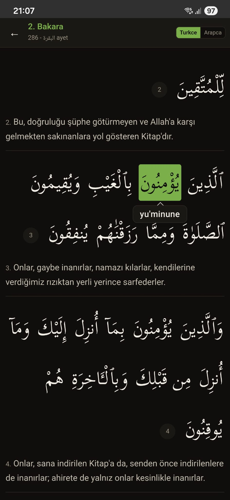

# Quran Word by Word Turkish

Kur'an-i Kerim'i Arapca okuyamayanlar icin **kelime kelime Turkce okunus** uygulamasi.

Herhangi bir Arapca kelimeye dokunun, o kelimenin Turkce okunusunu hecelenmis olarak gorun.

<p align="center">
  
</p>

## Kurulum

### Obtainium (Onerilen)

[Obtainium](https://obtainium.imranr.dev/) ile kurarsaniz yeni surum ciktiginda otomatik guncelleme alirsiniz.

1. Obtainium'u telefonunuza kurun
2. **Add App** butonuna basin
3. URL olarak su adresi girin:
   ```
   https://github.com/Quirah/quran-word-by-word-turkish
   ```
4. **Add** — uygulama indirilir ve kurulur

### Manuel

[Releases](https://github.com/Quirah/quran-word-by-word-turkish/releases) sayfasindan APK indirip kurun.

## Ozellikler

- **114 sure, 6236 ayet** — Kur'an'in tamami
- **Kelimeye dokun, okunusu gor** — Hecelenmis Turkce okunus bubble olarak cikar
- **Diyanet Isleri meali** — Her ayetin altinda Turkce anlam
- **Sure secim ekrani** — Arama destegi, son okunan sure isaretli
- **Kaldigi yerden devam** — Uygulama kapansa bile son sure ve yeriniz saklanir
- **3 tema:** Papirus, Deniz, Gece
- **Yazi boyutu ayari**
- **Tamamen offline**

## Nasil Calisiyor?

[QuranWBW](https://quranwbw.com)'den Ingilizce kelime-kelime hece yapisi, [Acik Kuran](https://acikkuran.com)'dan Turkce okunus verisi alinir. Bu iki veri hizalama algoritmasi ile birlestirilip her Arapca kelime icin hecelenmis Turkce okunus uretilir.

```
QuranWBW (Ingilizce):   "Maa-li-ki"  "Yaw-mid-"  "Deen"
Acik Kuran (Turkce):    "maliki yevmid din"
         ↓
Sonuc:                  "ma-li-ki"   "yev-mid-"  "din"
```

Hazir veri `output/turkish-syllables.json` dosyasinda 6236 ayet icin mevcuttur.

## Kaynaklar ve Tesekkur

- [QuranWBW](https://quranwbw.com) — Kelime-kelime hece yapisi (MIT)
- [Acik Kuran](https://acikkuran.com) — Turkce fonetik okunus (CC BY-NC-SA 4.0)
- [Mahfuz](https://github.com/Quirah/mahfuz) — Arapca Osmani metni ve arayuz tasarim referansi
- [Diyanet Isleri Baskanligi](https://www.diyanet.gov.tr) — Turkce meal

## Lisans

Kaynak kodu **MIT**. Veri dosyalari kaynaklarinin orijinal lisanslarina tabidir.
